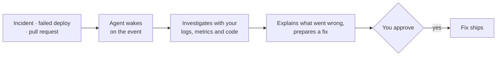

<picture>
  <source media="(prefers-color-scheme: dark)" srcset="https://raw.githubusercontent.com/agentsfleet/agentsfleet/main/branding/agentsfleet-dark.svg" />
  <source media="(prefers-color-scheme: light)" srcset="https://raw.githubusercontent.com/agentsfleet/agentsfleet/main/branding/agentsfleet-light.svg" />
  
</picture>

# Hi, I'm Kishore 👋

**I build system software in weeks, not years.** Shipping open-source infrastructure since 2012, from Noida, India.

Now building **[agentsfleet](https://agentsfleet.net)**: an open-source runtime that wakes an AI agent when production breaks, lets it investigate with your logs, metrics and code, and records every run. You bring the model key and approve what ships.

---

## What happens when an incident fires

Chat bots answer when you mention them; an agentsfleet agent starts when your pager does. Each agent is a `SKILL.md` for the job and a `TRIGGER.md` for its access, so it touches only the tools, secrets and hosts you declared. Every run lands in a replayable activity stream, on whichever model key you bring, Claude or Grok included.

**Early access is by invitation.** Write to [nkishore@megam.io](mailto:nkishore@megam.io) and I'll set you up.

## Current projects

| | Project | What it is |
|---|---|---|
| 🛸 | **[agentsfleet](https://github.com/agentsfleet/agentsfleet)** | Open-source runtime for event-triggered agents: Rust control plane plus the `agentsfleet` Command Line Interface (CLI). |
| 🛡️ | **[orly](https://github.com/agentsfleet/orly)** | Guardrails for coding agents: rules they read before editing, git-hook gates that fail the commit when they don't. [`@agentsfleet/orly`](https://www.npmjs.com/package/@agentsfleet/orly) |
| 📝 | **[agentsfleet/docs](https://github.com/agentsfleet/docs)** | Source for [docs.agentsfleet.net](https://docs.agentsfleet.net). |
| ⚡ | **[cache-kit.rs](https://github.com/megamsys/cache-kit.rs)** | Fully generic cache framework for Rust, on [crates.io](https://crates.io/crates/cache-kit). |

## Track record

- **2026 → now · [agentsfleet](https://agentsfleet.net):** open-source runtime for agents that wake on production events.
- **[Rio OS](https://rioos.megam.io):** enterprise cloud operating system. Rust core, Go tooling, a mission-control console. *(archived)*
- **2012 · [Megam](https://megam.io):** open-source private cloud platform. Scala API gateway, Go scheduler, JavaScript console; [nilavu](https://github.com/megamsys/nilavu) drew 165 forks.

All legacy repositories

**[@megamsys](https://github.com/megamsys): open-source private cloud management platform**

- ☁️ **[verticegateway](https://github.com/megamsys/verticegateway)**: REST API server with built-in auth, ScyllaDB/Cassandra interface *(Scala, archived)*
- ⚙️ **[vertice](https://github.com/megamsys/vertice)**: omni scheduler and core engine for Megam Vertice *(Go, archived)*
- 🖥️ **[nilavu](https://github.com/megamsys/nilavu)**: open-source cloud management platform *(JavaScript, archived)*
- 🌐 **[www.megam.io](https://github.com/megamsys/www.megam.io)**: marketing site *(TypeScript)*
- 📝 **[docs.megam.io](https://github.com/megamsys/docs.megam.io)**: documentation *(MDX)*

**[@rioos2](https://github.com/rioos2): enterprise cloud operating system *(archived)***

- 🎛️ **[commandcenter](https://github.com/rioos2/commandcenter)**: command center and mission control for the datacenter *(JavaScript)*
- 🤖 **[autorio](https://github.com/rioos2/autorio)**: automation layer *(Ruby)*
- 🧰 **[beedi](https://github.com/rioos2/beedi)**: infrastructure tooling *(Go)*
- 🧩 **[aran](https://github.com/rioos2/aran)**: core systems *(Rust)*
- 🌐 **[rioos.megam.io](https://github.com/rioos2/rioos.megam.io)**: documentation site *(MDX)*

## Also

- 📋 **Evangelizing opinionated AGENTS.md** so every coding agent knows the rules of engagement; [orly](https://github.com/agentsfleet/orly) enforces them.
- 🖥️ **CLI-first tools for macOS**, terminal-native developer experiences.
- 🏢 **Platform engineering at E2E Networks Limited**, shaping infrastructure from Noida.

## Stack

Pairing with

---

**⚡ Trillion Agents getting triggered triggered triggered**

**Ship beats perfect.**

